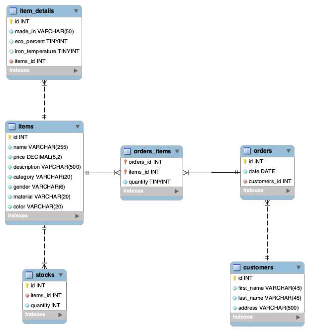
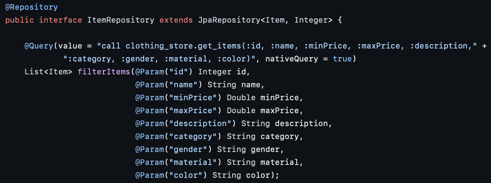
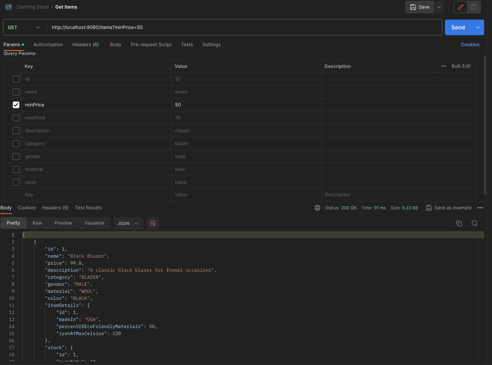

## Name of the project
Online Clothing Store - Backend

## Author
Giurgiu Florin Mircea

### General presentation

This project covers the backend for an online clothing store. With an MVC architecture, 
it provides CRUD-type endpoints.

To create the necessary database for this project, please refer to src/files, 
where you will find the following:
- create_online_store_database.sql - this file completely sets up the database, including its architecture and procedures.
- populate-database.sql - this file populates the database with initial data for manipulation.

### Schema of relational logic

  To interact with data in the database, Java code uses the native SQL language,
however, in order to expose as little of the tabular structure as possible, database queries
are executed by calling procedures and passing arguments.

If the operational mechanism of the procedure is to be changed, this will not
affect the Java code as long as the procedure retains its signature.

See the example below:

### Example of GET request
The endpoint in the example below shows a GET request that allows filtering the result based on the sent arguments.

